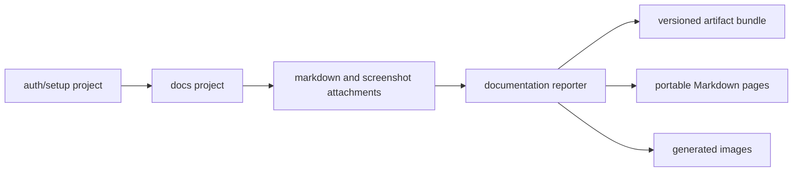

# Competitive landscape & framework API research

Research date: 2026-03-27. Sources: official docs, npm registry pages, GitHub READMEs and ARCHITECTURE.md only.

## 1. Executive summary

**qa-instructions** targets a narrow pipeline: automated tests capture a runner-agnostic `QaRunBundle`, a separate render step produces **plain-text ticket QA steps** (numbered action + expected, one prerequisite line), not product docs or dev HTML reports ([project design](../design.md)).

No surveyed product delivers all three: (a) deterministic capture from tests, (b) explicit collect/render separation, and (c) ticket-style QA step output. The closest architectural peer is **[docs-tests](https://github.com/heddendorp/docs-tests)** — same Playwright attach + custom reporter pattern, but it renders portable Markdown in the reporter pass and optimizes for product documentation prose ([ARCHITECTURE.md](https://github.com/heddendorp/docs-tests/blob/main/ARCHITECTURE.md), [README](https://github.com/heddendorp/docs-tests/blob/main/README.md)).

Playwright provides the exact hooks qa-instructions uses: `test.step()` with `TestStepInfo.attach()` (v1.51+), `testInfo.attach()` for bundle JSON, and `Reporter.onTestEnd()` reading `TestResult.attachments` and `TestResult.steps` ([TestStepInfo](https://playwright.dev/docs/api/class-teststepinfo), [TestResult](https://playwright.dev/docs/api/class-testresult), [Reporter](https://playwright.dev/docs/api/class-reporter)). Jest has no equivalent step tree or per-step attach API; a future adapter would combine `TestEnvironment.handleTestEvent()` for capture with a custom `Reporter` for collection ([Test Environment](https://jestjs.io/docs/test-environment), [jest-circus events](https://github.com/jestjs/jest/blob/main/packages/jest-circus/README.md), [Reporter interface](https://github.com/jestjs/jest/blob/main/packages/jest-reporters/src/types.ts)).

**Recommendation:** Continue building **qa-instructions** for the ticket QA-steps contract and runner-agnostic render layer; open a focused upstream PR to **docs-tests** only if the team commits to Playwright-only capture and wants to share the attach/reporter layer without maintaining a separate bundle schema.

---

## 2. Competitor table

Direction legend: **→** = tests/recordings produce human docs/steps; **←** = manual input produces tests.

| Product                                 | Primary source                                                                                                                                                                                                 | Direction                      | Screenshots                            | Human output format                                          | Collect / render split                                 | Ticket QA steps                 | Runner-agnostic capture                  |
| --------------------------------------- | -------------------------------------------------------------------------------------------------------------------------------------------------------------------------------------------------------------- | ------------------------------ | -------------------------------------- | ------------------------------------------------------------ | ------------------------------------------------------ | ------------------------------- | ---------------------------------------- |
| **qa-instructions** (this project)      | [README](../README.md), [design](../design.md)                                                                                                                                                                 | tests → steps                  | Per step                               | Plain numbered list for Jira                                 | **Yes** (reporter collects; CLI renders)               | **Yes** (design target)         | **Yes** (design; Playwright v0.1)        |
| **docs-tests**                          | [npm](https://www.npmjs.com/package/docs-tests), [README](https://github.com/heddendorp/docs-tests/blob/main/README.md), [ARCHITECTURE.md](https://github.com/heddendorp/docs-tests/blob/main/ARCHITECTURE.md) | tests → docs                   | Per screenshot helper                  | Portable Markdown pages + `docs-tests.bundle.json`           | **Partial** (reporter renders Markdown)                | No (narrative docs)             | No (Playwright only)                     |
| **playwright-checkpoint**               | [npm](https://www.npmjs.com/package/playwright-checkpoint), [README](https://github.com/pm990320/playwright-checkpoint/blob/main/README.md)                                                                    | tests → help articles          | Per checkpoint (PNG + many collectors) | HTML default; Markdown help articles via `markdown` reporter | **Partial** (manifest at run time; `report` CLI after) | No (help-center prose)          | No                                       |
| **playwright-scenario-recorder**        | [npm](https://www.npmjs.com/package/playwright-scenario-recorder), [README](https://github.com/FR-k-sakamoto/playwright-scenario-recorder/blob/main/README.md)                                                 | tests → manuals                | Annotated per step                     | Markdown (+ optional PDF)                                    | **No** (`generate()` in test/fixture teardown)         | No                              | No                                       |
| **Serenity/JS + Serenity BDD**          | [Reporting handbook](https://serenity-js.org/handbook/reporting/), [Serenity BDD Reporter](https://serenity-js.org/handbook/reporting/serenity-bdd-reporter/)                                                  | tests → living docs            | Photographer + archiver                | HTML living documentation (Serenity BDD CLI)                 | **No** (event → JSON → HTML pipeline)                  | No                              | Partial (Playwright, WebdriverIO, etc.)  |
| **browser-agent-recorder**              | [README](https://github.com/VelvetAbyss/browser-agent-recorder/blob/main/README.md)                                                                                                                            | record → SOP                   | Highlighted per step                   | Markdown SOP (+ Playwright export)                           | N/A (Chrome extension)                                 | Partial (SOP, not ticket field) | No                                       |
| **playwright-custom-report**            | [README](https://github.com/github-rhobin/playwright-custom-report/blob/main/README.md)                                                                                                                        | tests → HTML report            | Inline under `test.step`               | Dev HTML report                                              | **No**                                                 | No                              | No                                       |
| **monocart-reporter**                   | [npm](https://www.npmjs.com/package/monocart-reporter), [README](https://github.com/cenfun/monocart-reporter/blob/main/README.md)                                                                              | tests → dev report             | Yes                                    | Tree grid + Markdown annotations                             | **No**                                                 | No                              | No                                       |
| **flowreplay**                          | [README](https://github.com/kuilenren/flowreplay/blob/main/README.md)                                                                                                                                          | demo → flow file               | No (locator replay)                    | Markdown `SKILL.md` + machine block                          | **No**                                                 | No                              | Partial (Python; not test-runner plugin) |
| **Playwright Test Agents**              | [Agents docs](https://playwright.dev/docs/test-agents)                                                                                                                                                         | plan → tests                   | Via trace in healer loop               | Markdown test plans in `specs/`                              | **No**                                                 | No                              | No                                       |
| **@cyborgtests/test**                   | [npm](https://www.npmjs.com/package/@cyborgtests/test), [README](https://github.com/CyborgTests/cyborg-test/blob/main/README.md)                                                                               | tests + **live** manual verify | No export focus                        | In-run UI; Playwright report annotations                     | N/A                                                    | No (pauses for human in CI)     | No                                       |
| **playwright-manual-to-test-generator** | [README](https://github.com/rmgoede/playwright-manual-to-test-generator/blob/main/README.md)                                                                                                                   | **←** manual → tests           | N/A                                    | Generates `.spec.ts`                                         | N/A                                                    | N/A                             | N/A                                      |
| **playwright-magic-steps**              | [npm](https://www.npmjs.com/package/playwright-magic-steps)                                                                                                                                                    | comments → steps               | No                                     | Playwright step tree only                                    | N/A                                                    | No                              | No                                       |
| **Allure / TestMo / Qase reporters**    | e.g. [allure-playwright](https://www.npmjs.com/package/allure-playwright)                                                                                                                                      | tests → TMS/report             | Yes                                    | SaaS / Allure HTML                                           | **No**                                                 | No                              | No                                       |

### npm search notes (2026-03-27)

Searches `playwright qa steps`, `playwright documentation reporter`, `test manual steps generator`, `docs-tests`, and `qa steps` did **not** surface a package combining ticket QA steps with a canonical bundle + separate render. Top hits were BDD wrappers, TMS reporters, **docs-tests**, **playwright-checkpoint**, **@cyborgtests/test** (manual steps _inside_ automation), and UI component libraries named “steps” ([npm search](https://www.npmjs.com/search?q=docs-tests)).

---

## 3. docs-tests deep comparison

Source: [docs-tests ARCHITECTURE.md](https://raw.githubusercontent.com/heddendorp/docs-tests/main/ARCHITECTURE.md) (GitHub raw, 2026-03-27).

### docs-tests system shape

Four parts: Playwright config/projects, optional auth setup, documentation specs, and a **custom reporter** that normalizes attachments into an artifact bundle and **renders portable Markdown pages** in the same pass.



### Attachment contract (capture)

Namespaced envelopes via `testInfo.attach` ([ARCHITECTURE.md](https://raw.githubusercontent.com/heddendorp/docs-tests/main/ARCHITECTURE.md)):

| Attachment                                              | Purpose                                                   |
| ------------------------------------------------------- | --------------------------------------------------------- |
| `docs-tests:guide`                                      | Guide metadata (`id`, `slug`, `title`, tags, permissions) |
| `docs-tests:markdown`                                   | Prose inserted into generated guide                       |
| `docs-tests:permissions`                                | Structured permission notes                               |
| `docs-tests:image:<name>` + `docs-tests:image-metadata` | Image bytes + metadata                                    |

Legacy names (`markdown`, `image`, etc.) remain supported. Unrelated attachments (traces, videos) are ignored.

### Output model (render — coupled)

Default output ([ARCHITECTURE.md](https://raw.githubusercontent.com/heddendorp/docs-tests/main/ARCHITECTURE.md)):

- `generated-docs/<slug>/page.md`
- `generated-docs/<slug>/*.png`
- `generated-docs/docs-tests.bundle.json` (alpha `docs-tests.bundle/v1alpha1`)
- `generated-docs/.docs-tests-manifest.json`

Publishing is **gated on a complete passing run**; staging dir → atomic publish; manifest-owned cleanup. Renderer emits **portable Markdown only** (no Liquid/MDX).

### Grouping & screenshots

- **Grouping:** Explicit `attachGuide()` metadata; multiple tests → sections in one page; fallback = nearest `test.describe` ([ARCHITECTURE.md](https://raw.githubusercontent.com/heddendorp/docs-tests/main/ARCHITECTURE.md)).
- **Screenshots:** `takeDocScreenshot()` highlights locators, waits two frames, captures PNG, supports redactions recorded in bundle ([ARCHITECTURE.md](https://raw.githubusercontent.com/heddendorp/docs-tests/main/ARCHITECTURE.md)).

### Side-by-side with qa-instructions

| Aspect                  | docs-tests                                                                             | qa-instructions                                                                                            |
| ----------------------- | -------------------------------------------------------------------------------------- | ---------------------------------------------------------------------------------------------------------- |
| Capture mechanism       | `testInfo.attach` namespaced envelopes                                                 | `qa-run-bundle` JSON + per-step `qa-screenshot` via `step.attach`                                          |
| Bundle file             | `docs-tests.bundle.json` (`v1alpha1`, alpha)                                           | `bundle.json` (`version: '1'`)                                                                             |
| Render timing           | **In reporter** (Markdown pages)                                                       | **Separate CLI** (`qa-instructions render`)                                                                |
| Output prose            | Product documentation narrative                                                        | Terse action + expected per step; prerequisite line                                                        |
| Grouping                | By guide / describe block                                                              | One bundle per test                                                                                        |
| Redaction / permissions | Built-in                                                                               | Out of scope v0.1                                                                                          |
| Playwright version      | `>=1.61.0 <2` ([README](https://github.com/heddendorp/docs-tests/blob/main/README.md)) | Step attach requires **≥1.51** ([TestStepInfo.attach](https://playwright.dev/docs/api/class-teststepinfo)) |

**Overlap:** ~70% on Playwright capture pattern (attachments + reporter). **Differentiation:** output contract (ticket qa-steps vs product docs) and explicit collect/render separation for multi-sink CI artifacts.

---

## 4. Playwright Reporter + TestStepInfo API

Official references: [Reporter](https://playwright.dev/docs/api/class-reporter), [TestStepInfo](https://playwright.dev/docs/api/class-teststepinfo), [TestInfo](https://playwright.dev/docs/api/class-testinfo), [TestResult](https://playwright.dev/docs/api/class-testresult), [TestStep](https://playwright.dev/docs/api/class-teststep), [test.step](https://playwright.dev/docs/api/class-test#test-step), [Custom reporters guide](https://playwright.dev/docs/test-reporters#custom-reporters), [Release notes — Test Step improvements](https://playwright.dev/docs/release-notes).

### Capture (worker process)

| API                                                     | Since     | Role for qa-instructions                                                                                                       |
| ------------------------------------------------------- | --------- | ------------------------------------------------------------------------------------------------------------------------------ |
| `test.extend({ fixture })`                              | —         | Expose `qa` fixture ([Playwright fixtures](https://playwright.dev/docs/test-fixtures))                                         |
| `test.step(title, async (step) => …)`                   | v1.10     | Step tree; `step` is `TestStepInfo` ([test.step](https://playwright.dev/docs/api/class-test#test-step))                        |
| `step.attach(name, { body \| path, contentType? })`     | **v1.51** | Per-step screenshot; attributed to step in reports ([TestStepInfo.attach](https://playwright.dev/docs/api/class-teststepinfo)) |
| `step.skip(condition?, description?)`                   | v1.51     | Conditional step skip ([TestStepInfo](https://playwright.dev/docs/api/class-teststepinfo))                                     |
| `testInfo.attach(name, { body \| path, contentType? })` | v1.10     | Test-level bundle JSON attachment ([TestInfo.attach](https://playwright.dev/docs/api/class-testinfo))                          |
| `page.screenshot()`                                     | —         | Capture primitive                                                                                                              |

**Important distinction:** `TestStep.attachments` on the reporter side lists attachments created during the step ([TestStep.attachments](https://playwright.dev/docs/api/class-teststep), v1.50+). `step.attach()` (v1.51+) attributes new attachments to the current step rather than the test ([TestStepInfo.attach](https://playwright.dev/docs/api/class-teststepinfo)).

### Collection (main process — `Reporter`)

Implement `Reporter` from `@playwright/test/reporter`; export default class; register via `reporter: [['./reporter', options]]` ([Custom reporters](https://playwright.dev/docs/test-reporters#custom-reporters)).

| Method                                   | When called                          | qa-instructions usage                                                                         |
| ---------------------------------------- | ------------------------------------ | --------------------------------------------------------------------------------------------- |
| `onBegin(config, suite)`                 | Once before run                      | Optional                                                                                      |
| `onTestBegin(test, result)`              | Test started                         | Optional                                                                                      |
| `onStepBegin(test, result, step)`        | Step started                         | Optional streaming                                                                            |
| `onStepEnd(test, result, step)`          | Step finished                        | Optional streaming                                                                            |
| **`onTestEnd(test, result)`**            | Test finished; **`result` complete** | **Read `qa-run-bundle` attachment + step attachments**                                        |
| `onEnd(result)`                          | All tests done (awaited)             | Optional aggregate                                                                            |
| `onExit()`                               | Before process exit                  | Upload artifacts                                                                              |
| `preprocess({ config, suite, testRun })` | Before `onBegin`                     | v1.62+ test filtering ([Reporter.preprocess](https://playwright.dev/docs/api/class-reporter)) |
| `printsToStdio()`                        | —                                    | Return `false` if non-TTY reporter                                                            |

Typical call order: `onBegin` → `onTestBegin` → (`onStepBegin`/`onStepEnd`)* → `onTestEnd` → `onEnd` → `onExit` ([Reporter](https://playwright.dev/docs/api/class-reporter)).

### `TestResult` fields used by collectors

From [TestResult](https://playwright.dev/docs/api/class-testresult):

```typescript
// attachments: { name, contentType, path?, body? }[]
result.attachments;

// steps: tree of TestStep (v1.10+)
result.steps;

// status, error, retry, duration, annotations, stdout/stderr
result.status;
result.retry; // use last attempt's bundle on retry
```

### `TestStep` fields used by collectors

From [TestStep](https://playwright.dev/docs/api/class-teststep):

| Field                           | Notes                                                                      |
| ------------------------------- | -------------------------------------------------------------------------- |
| `category`                      | Filter `test.step` vs `pw:api`, `expect`, `fixture`, `hook`, `test.attach` |
| `title`                         | Step title                                                                 |
| `attachments`                   | Step-scoped attachments (v1.50+)                                           |
| `steps`                         | Nested steps                                                               |
| `duration`, `error`, `location` | Diagnostics                                                                |

Built-in categories ([TestStep.category](https://playwright.dev/docs/api/class-teststep)): `expect`, `fixture`, `hook`, `pw:api`, `test.step`, `test.attach`.

### qa-instructions mapping (implemented)

Local implementation ([`packages/playwright/src/fixture.ts`](../../packages/playwright/src/fixture.ts), [`packages/playwright/src/reporter/collector.ts`](../../packages/playwright/src/reporter/collector.ts)):

1. **Fixture:** `base.step(action, …)` → `step.attach('qa-screenshot', …)` → `testInfo.attach('qa-run-bundle', …)`.
2. **Reporter:** `onTestEnd` → parse last `qa-run-bundle` → walk `result.steps` where `category === 'test.step'` → match `qa-screenshot` bodies → `writeBundle()`.

Keep Playwright **`html`** reporter enabled for native step attachment previews ([HTML reporter](https://playwright.dev/docs/test-reporters#html-reporter)).

---

## 5. Jest Reporter + TestEnvironment API

Official references: [Test Environment](https://jestjs.io/docs/test-environment), [testEnvironment config](https://jestjs.io/docs/configuration#testenvironment-string), [reporters config](https://jestjs.io/docs/configuration#reporters-arraymodulename--modulename-options), [jest-circus README](https://github.com/jestjs/jest/blob/main/packages/jest-circus/README.md), [Reporter interface (source)](https://github.com/jestjs/jest/blob/main/packages/jest-reporters/src/types.ts).

### Capture — `TestEnvironment` (per test file)

Each test file gets its own environment instance; `setup`/`teardown` once per file ([Test Environment](https://jestjs.io/docs/test-environment)).

Extend `jest-environment-node` or implement `JestEnvironment` ([Test Environment — Extending](https://jestjs.io/docs/test-environment#extending-built-in-environments)):

```typescript
class CustomEnvironment extends NodeEnvironment {
  constructor(config: JestEnvironmentConfig, context: EnvironmentContext) { … }
  async setup(): Promise<void> { … }
  async teardown(): Promise<void> { … }
  getVmContext(): Context | null { … }
  async handleTestEvent(event: Event, state: State): Promise<void> { … }
}
```

Configure: `testEnvironment: './custom-environment.js'` ([testEnvironment](https://jestjs.io/docs/configuration#testenvironment-string)).

**jest-circus events** (bind via `handleTestEvent`; see [type definitions](https://github.com/jestjs/jest/blob/main/packages/jest-types/src/Circus.ts)):

| Event                                                      | Async waited? | Capture use                            |
| ---------------------------------------------------------- | ------------- | -------------------------------------- |
| `test_start`                                               | Yes           | Begin step list for test               |
| `test_done`                                                | Yes           | Finalize bundle; screenshot on failure |
| `test_fn_start` / `test_fn_success` / `test_fn_failure`    | Yes           | Wrap explicit `qa.step()`              |
| `hook_start` / `hook_done`                                 | Yes           | Exclude or tag hook noise              |
| `start_describe_definition` / `finish_describe_definition` | **No** (sync) | Suite structure                        |
| `add_hook` / `add_test` / `error`                          | **No** (sync) | Definition phase                       |

Circus **pauses until** `handleTestEvent` promises settle, except sync events listed above ([jest-circus README](https://github.com/jestjs/jest/blob/main/packages/jest-circus/README.md)).

**Gap vs Playwright:** Jest has **no** native step tree or attachment API equivalent to `test.step` + `step.attach`. A Jest adapter must:

- Require explicit `qa.step(action, expected, fn)` in tests.
- Capture screenshots inside the environment (e.g. jest-playwright `PlaywrightEnvironment` pattern on `test_done`).
- Persist bundle to disk or global state for the reporter (no `testInfo.attach`).

Per-file pragma: `@jest-environment ./my-env` ([Test Environment](https://jestjs.io/docs/test-environment)).

### Collection — `Reporter` (main process)

Configure: `reporters: ['default', ['./custom-reporter.js', options]]` ([reporters](https://jestjs.io/docs/configuration#reporters-arraymodulename--modulename-options)).

Constructor: `(globalConfig, reporterOptions, reporterContext)` ([reporters](https://jestjs.io/docs/configuration#reporters-arraymodulename--modulename-options)).

**`Reporter` interface** ([types.ts](https://github.com/jestjs/jest/blob/main/packages/jest-reporters/src/types.ts)):

| Hook                                                   | Purpose                                             |
| ------------------------------------------------------ | --------------------------------------------------- |
| `onRunStart(results, options)`                         | Run beginning                                       |
| `onTestFileStart(test)`                                | File started                                        |
| `onTestStart(test)`                                    | Legacy file-level                                   |
| `onTestCaseStart(test, testCaseStartInfo)`             | Single `it()` starting                              |
| `onTestCaseResult(test, testCaseResult)`               | Single `it()` finished — **primary collector hook** |
| `onTestResult(test, testResult, aggregatedResult)`     | File result                                         |
| `onTestFileResult(test, testResult, aggregatedResult)` | File result (preferred over `onTestResult`)         |
| `onRunComplete(testContexts, results)`                 | Run finished (awaited)                              |
| `getLastError()`                                       | Force non-zero exit                                 |

**vs Playwright:** Jest reporters can observe per-test-case results during the run; `testResultsProcessor` only runs after all tests ([reporters note](https://jestjs.io/docs/configuration#reporters-arraymodulename--modulename-options)). Neither provides step attachments — collector must read files written by the environment.

---

## 6. Gaps that remain unserved

| Gap                                                                                                   | Evidence                                                                                                                                                                                                                                                                                                                                                                                                                                                                                                                        |
| ----------------------------------------------------------------------------------------------------- | ------------------------------------------------------------------------------------------------------------------------------------------------------------------------------------------------------------------------------------------------------------------------------------------------------------------------------------------------------------------------------------------------------------------------------------------------------------------------------------------------------------------------------- |
| **Ticket-field QA steps** (numbered, action + expected, prerequisite) from automated runs             | docs-tests → Markdown product docs ([ARCHITECTURE.md](https://raw.githubusercontent.com/heddendorp/docs-tests/main/ARCHITECTURE.md)); checkpoint/scenario-recorder → help/manual Markdown ([checkpoint README](https://github.com/pm990320/playwright-checkpoint/blob/main/README.md), [scenario-recorder README](https://github.com/FR-k-sakamoto/playwright-scenario-recorder/blob/main/README.md)); Serenity → HTML living docs ([Serenity BDD Reporter](https://serenity-js.org/handbook/reporting/serenity-bdd-reporter/)) |
| **Explicit collect → render split** with one canonical bundle → many sinks (qa-steps, markdown, json) | docs-tests renders in reporter; scenario-recorder renders in test teardown; checkpoint separates manifest capture from `report` CLI but output is help Markdown/HTML, not ticket steps                                                                                                                                                                                                                                                                                                                                          |
| **Runner-agnostic bundle** (same JSON contract from Playwright, Jest, DevTools import)                | All doc generators above are Playwright-specific or non-test (browser-agent-recorder, flowreplay)                                                                                                                                                                                                                                                                                                                                                                                                                               |
| **Deterministic, non-LLM** manual QA export                                                           | Playwright agents produce Markdown **plans**, not ticket steps ([Agents](https://playwright.dev/docs/test-agents)); manual-to-test tools go the **opposite** direction ([manual-to-test README](https://github.com/rmgoede/playwright-manual-to-test-generator/blob/main/README.md))                                                                                                                                                                                                                                            |
| **Jest (or Vitest) parity** with step-scoped screenshots                                              | Jest lacks step attach API ([Test Environment](https://jestjs.io/docs/test-environment)); Vitest has no equivalent reporter step tree in surveyed docs                                                                                                                                                                                                                                                                                                                                                                          |
| **In-run manual verification → exported steps**                                                       | @cyborgtests/test pauses for human confirmation in CI; does not emit pasteable QA scripts ([README](https://github.com/CyborgTests/cyborg-test/blob/main/README.md))                                                                                                                                                                                                                                                                                                                                                            |

The **narrowest unserved wedge** for qa-instructions: _paste-ready ticket QA steps_ + _canonical bundle_ + _render decoupled from capture_.

---

## 7. Recommendation: build vs contribute upstream

### Build qa-instructions (recommended default)

Proceed when:

- Ticket **qa-steps** format must work for real QA paste-into-Jira workflows (validated outside this doc).
- Same capture run must feed **multiple render targets** (qa-steps, markdown, json) without re-running tests ([design](../design.md)).
- **Jest** or DevTools Recorder import is on the roadmap ([design](../design.md)).

Playwright APIs are stable and sufficient; no upstream blocker.

### Contribute upstream to docs-tests (conditional)

Consider a PR adding a **`qa-steps` render mode** (or consumer of `docs-tests.bundle.json`) when:

- Scope stays **Playwright-only** indefinitely.
- Product docs and ticket steps can share **the same capture** (`attachGuide`, `takeDocScreenshot`).
- Team accepts docs-tests’ **alpha bundle contract** (`docs-tests.bundle/v1alpha1`) and reporter-coupled publish rules ([README](https://github.com/heddendorp/docs-tests/blob/main/README.md)).

Upstream contribution does **not** replace qa-instructions if collect/render separation or runner-agnostic `QaRunBundle` remains a requirement — docs-tests explicitly renders Markdown in the reporter ([ARCHITECTURE.md](https://raw.githubusercontent.com/heddendorp/docs-tests/main/ARCHITECTURE.md)).

### Suggested path

1. **Ship** Playwright adapter + `renderQaSteps` + CLI (current scope).
2. **Validate** qa-steps output with one real ticket QA cycle.
3. **Optionally** propose docs-tests bundle consumer or renderer PR as a capture-sharing experiment — do not block qa-instructions on upstream acceptance.
4. **Defer** Jest adapter until Playwright loop is proven; use [TestEnvironment](https://jestjs.io/docs/test-environment) + [Reporter](https://github.com/jestjs/jest/blob/main/packages/jest-reporters/src/types.ts) with explicit `qa.step()` only.

---

## Appendix: npm packages reviewed but not overlapping

| Package                                                                        | Why excluded from direct competition                    |
| ------------------------------------------------------------------------------ | ------------------------------------------------------- |
| [playwright-bdd](https://www.npmjs.com/package/playwright-bdd)                 | Gherkin execution, not QA step export                   |
| [allure-playwright](https://www.npmjs.com/package/allure-playwright)           | TMS/reporting ([Allure](https://allurereport.org/))     |
| [@decocms/qa](https://www.npmjs.com/package/@decocms/qa)                       | E2E purchase journey + JUnit for deco.cx stores         |
| [@qawolf/cli](https://www.npmjs.com/package/@qawolf/cli)                       | Managed QA Wolf flows ([docs](https://docs.qawolf.com)) |
| [agent-qa](https://www.npmjs.com/package/agent-qa)                             | Agentic self-improving harness                          |
| [playwright-magic-steps](https://www.npmjs.com/package/playwright-magic-steps) | Comment → `test.step` transform only                    |
